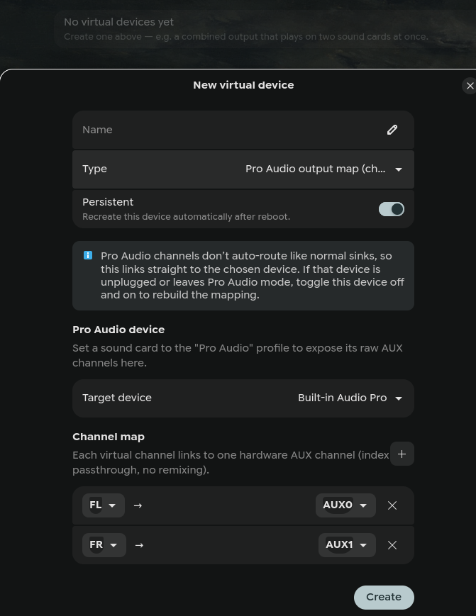
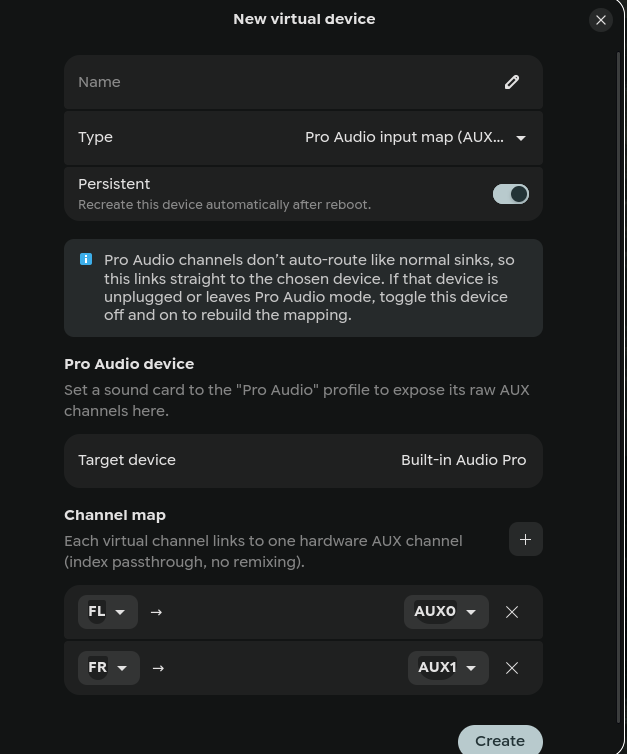
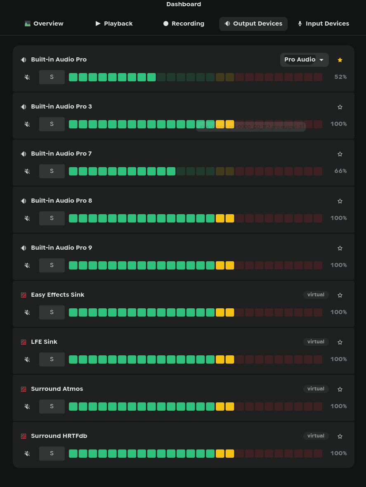
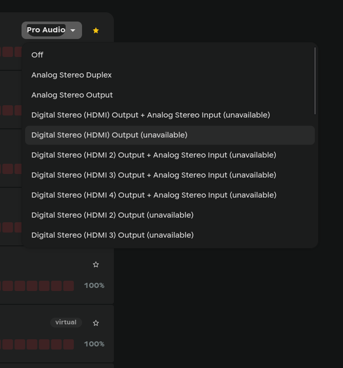
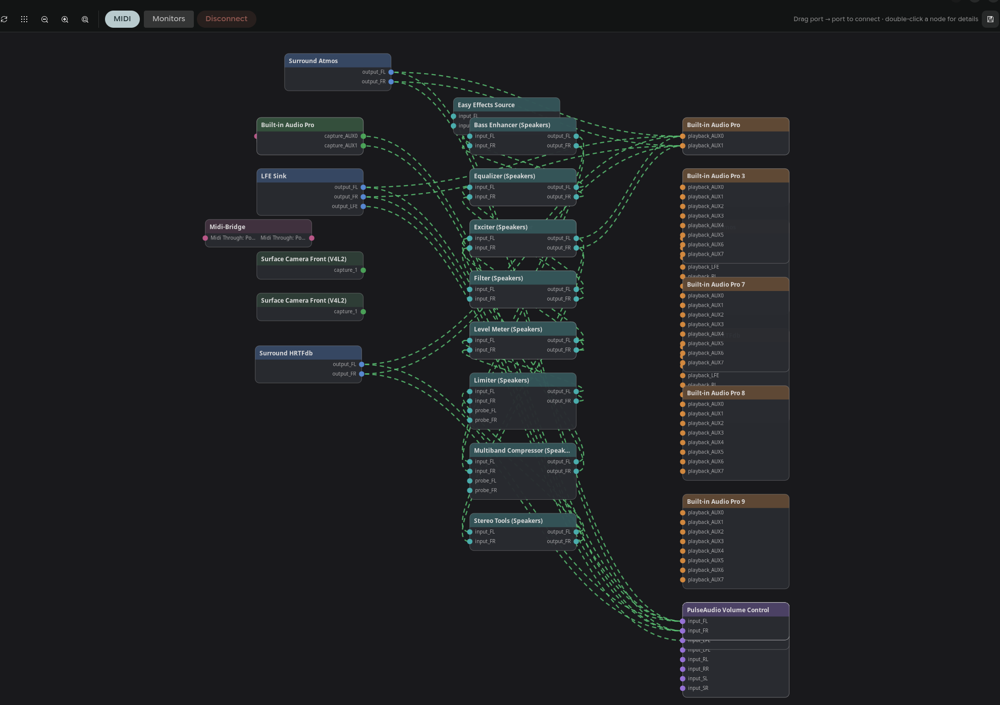

<!--
HOW TO ADD A NEW ENTRY (for the next big update):
Copy the block below to the TOP of the list (newest first) and fill it in.

## [vX.Y.Z](https://github.com/knightinfected/PipeWireController/releases/tag/vX.Y.Z) — YYYY-MM-DD
**One-line headline of the release**
- Highlight one
- Highlight two

Screenshots: take them, save as kebab-case PNGs in `screenshots/`, then add the
`` line. Leave a placeholder note (like the
0.3.2 entry) until the image exists so the page never shows a broken image.
-->

# Changelog — release highlights

The bigger updates, newest first, with screenshots. This is a curated
highlights reel, not an exhaustive log — for the complete history see the
[GitHub releases](https://github.com/knightinfected/PipeWireController/releases)
and commit log.

---

## [v0.3.2](https://github.com/knightinfected/PipeWireController/releases/tag/v0.3.2) — 2026-07-23
**Pro Audio channel maps and a dashboard configuration switcher**

- **Pro Audio channel map** (Virtual Devices) — map a friendly channel layout
  onto the generic AUX channels a card exposes in its *Pro Audio* profile
  (e.g. a stereo sink whose FL/FR land on the interface's AUX0/AUX1). Both
  output and input directions, arbitrary N-channel maps. The links survive
  reboots and PipeWire restarts.
- **Dashboard configuration switcher** — change a card's profile (Analog
  Stereo Duplex, Pro Audio, HDMI, Off, …) straight from the Output/Input
  Devices tabs, like pavucontrol's Configuration tab.
- **`pyproject.toml`** — a proper Python project (metadata, entry point, and
  dev tooling for type-checking/linting).
- Virtual-device dialog is now a **resizable window** with a larger default
  size; fixed note-wrapping and dropdown truncation in that dialog.

---

## [v0.3.1](https://github.com/knightinfected/PipeWireController/releases/tag/v0.3.1) — 2026-07-23
**Server tuning fixes — feedback from Wim Taymans (creator of PipeWire)**

- Raised the quantum hard-limit ceiling (8192 was only ~43 ms at 192 kHz;
  the dropdown now reaches 32768, real cap 65536) and explained the
  frames-vs-rate trade-off inline.
- Corrected the `link.max-buffers` description (it's mostly about video
  buffers, not audio) and its default.
- Added a **Custom…** typed entry to the Default/Minimum/Maximum quantum
  dropdowns for values off the preset list.

---

## [v0.3.0](https://github.com/knightinfected/PipeWireController/releases/tag/v0.3.0) — 2026-07-22
**The big one — Patchbay, Monitor, Virtual Devices, Effects, App Policies**

- **Patchbay** — live audio + MIDI node graph, drag-to-connect, node metadata
  editor, routing snapshots (save/recall/export/import).
- **Monitor** — service CPU/RAM, xruns, DSP load, live `pw-top`, journal
  follow, desktop notifications.
- **Virtual Devices** — null sinks, virtual mics, combine/aggregate devices,
  buses.
- **Effects** — LADSPA/LV2 discovery and an insert-rack chain.
- **App Policies & per-device rules** — per-app routing, default-device
  priority, clock master, per-device rate/format/period/headroom/rename/hide,
  plus per-device Bluetooth profile & codec and dashboard mixer solo.

