<!--
HOW TO ADD A NEW ENTRY (for the next big update):
Copy the block below to the TOP of the list (newest first) and fill it in.

## [vX.Y.Z](https://github.com/knightinfected/PipeWireController/releases/tag/vX.Y.Z) — YYYY-MM-DD
**One-line headline of the release**
- Highlight one
- Highlight two

Screenshots: take them, save as kebab-case PNGs in `screenshots/`, then add the
`` line. Leave a placeholder note (like the
0.3.2 entry) until the image exists so the page never shows a broken image.
-->

# Changelog — release highlights

The bigger updates, newest first, with screenshots. This is a curated
highlights reel, not an exhaustive log — for the complete history see the
[GitHub releases](https://github.com/knightinfected/PipeWireController/releases)
and commit log.

---

## [v0.5.1](https://github.com/knightinfected/PipeWireController/releases/tag/v0.5.1) — 2026-08-16

**Crossovers — send each band of the audio to a destination of its own**

A **crossover** is a new kind of object on the Signal Paths board, and it sits
where it belongs: between what plays and what it comes out of. It stands in
front of an output, so apps keep playing exactly where they always played, and
it hands each band of that audio to the destinations you choose.

The card is a table. One row per band, and each row says two things:

| band | goes to |
|---|---|
| 80 Hz and below | Internal audio |
| 80 Hz – 2 kHz | Focusrite Scarlett 2i2 |
| 2 kHz and above | Internal audio |

Add a band, drag its edges, give it as many destinations as you like. Two
bands naming the same destination are summed. Bands use Linkwitz-Riley filters
at 12, 24 or 48 dB/oct, so two bands meeting at one frequency add back up flat
— and each one carries its own level, delay and polarity, because drivers are
rarely the same distance away or wired the same way round.

**Your inputs and outputs are untouched.** The crossover publishes nothing
selectable: it attaches to the output as a `filter.smart` insert and reaches
its other destinations through capture streams. Nothing new appears in the
sound settings, and no app has to be repointed. One crossover is one unit,
whatever the number of bands.

The **“Subwoofer and satellites”** recipe builds a two-band crossover in one
click. For a single card that carries the bands on different channels — a 2.1
or 5.1 output — the **Crossover stage** and the **“Bass management”** template
do that inside one strip instead.

**Strips insert themselves into an output instead of becoming one**

A strip used to publish a sink, which meant every equalizer and every
crossover added entries to the sound settings and asked you to go and select
one of them. A strip now has a **mode**:

- **inside the output** (the new default): it attaches to a device as a
  `filter.smart` insert. WirePlumber routes everything heading for that device
  through the strip first. Your inputs and outputs are untouched, nothing new
  appears anywhere, and no app is repointed.
- **its own output**: the previous behaviour, kept for the case that needs it
  — a bus something else has to *choose*, like the capture sink OBS records
  from. A mix that a source strip sends to falls back to this automatically.
- **a copy of another strip**: a capture stream, not a sink. It is how one
  band of a crossover reaches a *second* card without an output being
  published to carry it.

Inserts are hidden from the Devices page, the dashboard and every target
picker, because nobody can usefully select one. Signal Paths still shows them
— it draws the strips themselves, with their volume and level meter.
“Equalize everything” and “Subwoofer and satellites” are both built this way
now, so neither adds anything to your device list.

**App Policy bug fixes and additions- rules now have a direction, plus snapshot
updates and a launch fix**

- **Bug: an app can now have an output *and* an input rule.** Previously, adding the second
  one used to silently replace the first. Rules now have a direction, so a VoIP app
  can be routed to your speakers while also being assigned a microphone, and the
  dialog says which direction it is setting instead of listing every endpoint
  and leaving you to guess
  ([#7](https://github.com/knightinfected/PipeWireController/issues/7)).
  Existing rules keep working, covering both directions.
- **Rules now apply to apps that are already playing** — saving one moves what
  is playing to match, and **Apply now** does the same for every rule at once.
  Before, a new rule did nothing until you restarted the app.
- **Added a switch to turn a rule off** without deleting it, for finding out
  whether a rule is the one misbehaving.
- **Rules that cannot do anything now say so** — an unplugged device, or a rule
  sitting under an identical one that already wins, is flagged in the list.
- **Added pinning for apps sent to a signal path or an equalizer**, so they come
  back on their own after a restart. Right-click the app on a Signal Paths card,
  or press the pin on the Equalizer page.
- **Added pattern and inverted matching** for application rules, shown when
  Advanced is on — match a regular expression like `^(firefox|chromium)$`, or
  invert a rule to mean "every app except this one".
- **Added Update for patchbay snapshots** — save the current patchbay over an
  existing one, instead of deleting it and typing the name again
  ([#5](https://github.com/knightinfected/PipeWireController/issues/5)). Saving
  over one by name now asks first; it used to replace it silently.
- **Bug: the app would not start on a clean install** —
  `ModuleNotFoundError: No module named 'cairo'`. pycairo is needed for the
  patchbay, meters and signal-path wires, but it is only an optional dependency
  of python-gobject. Now a dependency of the AUR package (0.5.0-2) and listed in
  the README. Affected every release since v0.4.0.

---

## [v0.5.0](https://github.com/knightinfected/PipeWireController/releases/tag/v0.5.0) — 2026-08-10

**Renamed the package, the command and the desktop entry — the app is still
PipeWire Controller**

An unrelated project has held `pipewire-controller` on PyPI since February
2026. Nothing about the two is related, but they install the same
`/usr/bin/pipewire-controller` and the same `pipewire-controller.desktop`, and
because a desktop entry in your home directory outranks the system one, having
both could make this app's launcher entry silently disappear. Rather than
contest a name that was there first, this release moves out of the way:

- The package and the command are now **`pipewire-control-center`**, with
  **`pwcc`** as a short alias — quicker to type, and unlike `pwctl` it cannot
  be mistaken for `wpctl`, WirePlumber's own CLI.
- The desktop entry is now `io.github.knightinfected.PipeWireControlCenter.desktop`,
  matching the application ID so the window and its launcher icon are properly
  associated (and so it is ready for the planned Flatpak).
- On Arch, `pipewire-controller` stays on the AUR as a transitional package, so
  an ordinary upgrade moves you across — nothing to uninstall by hand.
- **Your settings are untouched.** `~/.config/pipewire-controller/` and the
  `99-pipewire-controller.conf` drop-ins keep their names, so every chain,
  signal path, equalizer and preference carries over as-is.

---

## [v0.4.0](https://github.com/knightinfected/PipeWireController/releases/tag/v0.4.0) — 2026-08-04

**Signal Paths — decide where audio comes in, what happens to it, and where it
goes**

A new page, and the first one that is about the *shape* of your audio rather
than about settings. A **source** is where sound enters — one app, a
microphone, or everything on the default output — and carries its own chain of
processing. A **mix** carries a chain of its own and feeds real devices.
Sources sit on the left, mixes on the right, and the sends between them are
drawn as curves, so a glance tells you what is going where.

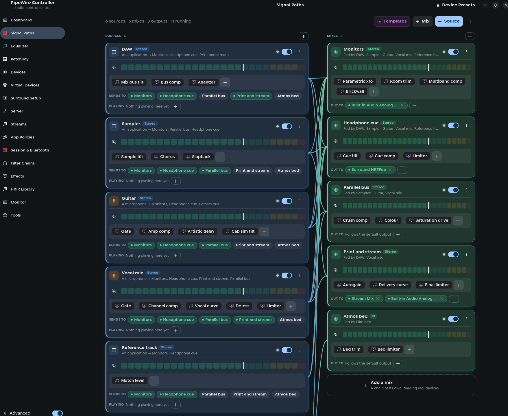

One source and one mix is a straight line, which is what most setups are. The
second column only earns its place once a chain has to split.

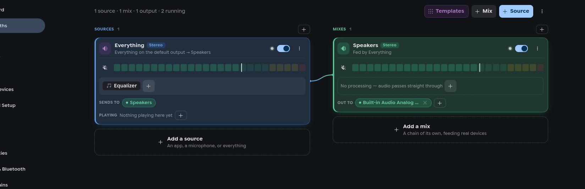

Splitting is the thing a single chain per output cannot do: one source
corrected four different ways, for four different pieces of hardware, without
building it four times.

A mix on its own is a perfectly good path too — audio goes into it and out to
your speakers, with nothing in front.

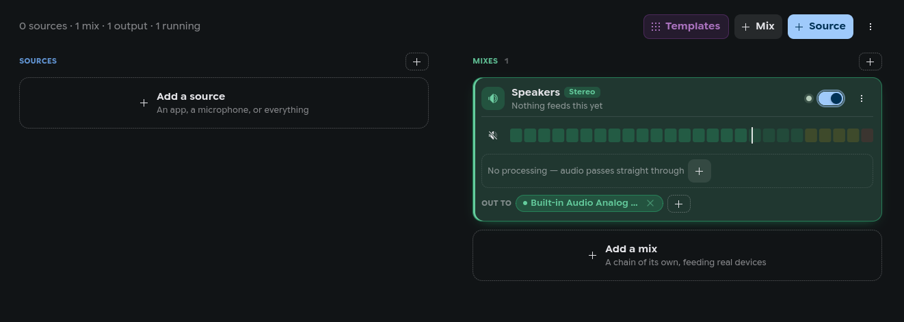

**You do not have to build any of it from scratch.** An empty board is the
template catalog: four complete paths that build both halves in one click, then
twenty-six ready-made strips running from the simplest at the top to the ones
people actually run for broadcast at the bottom — bass boost, a loudness curve
for listening quietly, crossfeed for headphones, a turntable chain, the
gate → tone → compressor → limiter voice chain, a mastering bus.

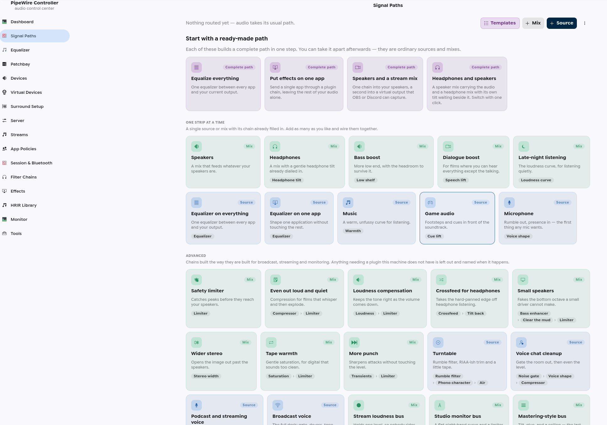

Each card draws the chain it is about to build. Anything wanting a plugin you
do not have says so on the card and is left out, rather than producing a strip
that will not start.

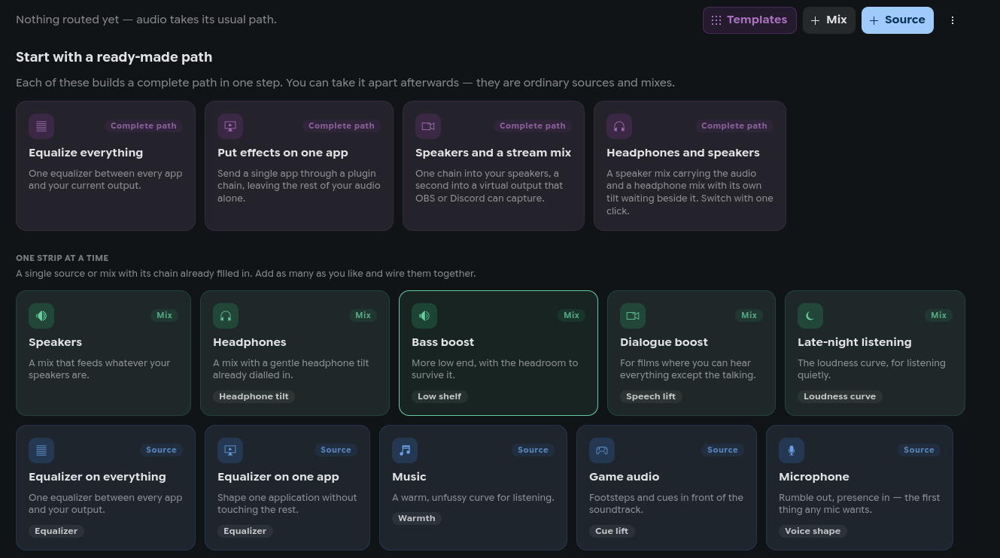

Once you have built something the catalog gets out of the way; the **Templates**
button up top opens it again as a searchable grid.

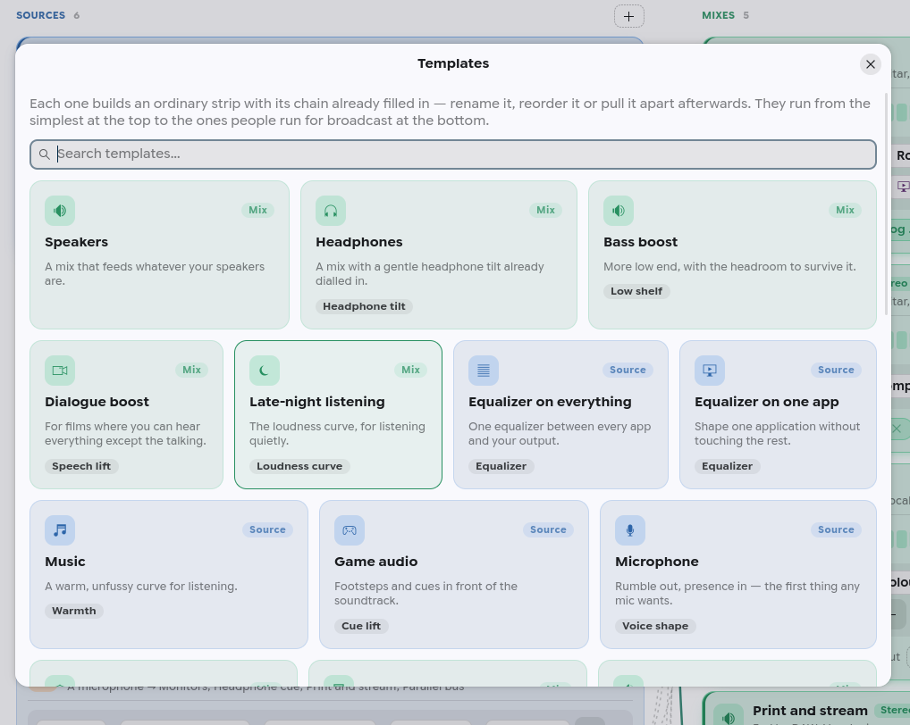

**Stages** are added to any strip: an equalizer whose bands you can move while
the audio plays, any LADSPA or LV2 plugin on the system, or an impulse response
file.

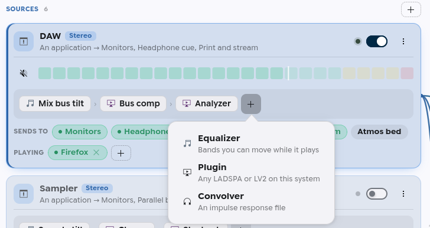

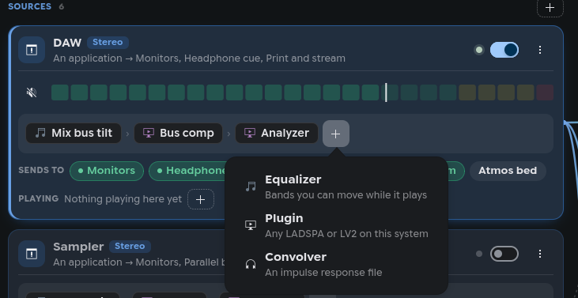

**Clearing up is one dialog.** Tick the strips to remove, or start the board
over — everything on it is listed with its chain, sends and state.

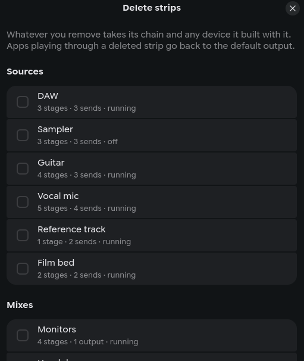

- **The board is handled directly, not through menus.** Drag a stage along its
  chain to reorder it, or onto another card to move it there. Drag a card to
  rearrange a column, or onto the opposite column to connect the two. Drag an
  app from one strip to another to move what it is playing through. While you
  are dragging, every place the thing could land says so, so you are never
  guessing at what is allowed.

- **A stage answers a click.** One click takes it in or out of the signal;
  double-click or right-click opens it. Everything is on the menu too —
  bypass, reorder, duplicate, remove.

- **Volume controls follow the style you picked** for the rest of the app, so
  the board matches the Dashboard.

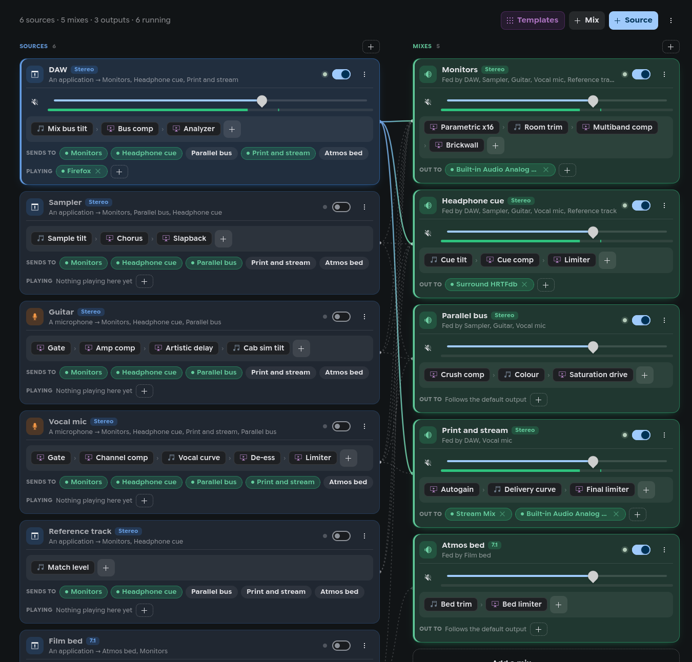

- **Colour tells you what you are looking at.** Sources are blue and mixes are
  green — the cards, the headings above them and the curves running between
  them use the same two colours, and a strip that is actually running carries
  its colour more strongly than one that is switched off. A send or an output
  turns green once it is carrying audio, so what is live is something you can
  see rather than something you have to read.
- **One process per chain, not one per plugin.** Every stage in a strip is
  compiled into a single filter graph: twenty effects are one entry in your
  device list and one buffer hop, instead of twenty of each. Hand-written
  configs force the opposite, which is how a serious chain ends up adding
  twenty quanta of latency.
- **Equalizer bands can be moved while the audio plays.** Signal Paths builds
  its equalizers from biquad filters rather than the preset-file kind, so
  frequency, gain and Q take effect as you change them — no restart, no gap.
- **Send one chain to several devices** and they are combined into one output
  for you; pick several outputs on a mix and the same thing happens. You never
  have to learn what a combine sink is.
- Chains, sends and outputs can be exported to a file and imported again.
  Imported paths arrive switched off so you can look before turning them on.

Fixed while building it:

- A board with more sources or mixes than fitted on screen **could not be
  scrolled** — the rest was simply cut off at the bottom of the window.
- The board **stopped following the graph**. A strip could be playing while its
  card still said nothing was playing there and showed no volume control at
  all; leaving the page and coming back was the only way to put it right. It
  now keeps up on its own, without tearing down a card you are working in.

**Effects and equalizers stop being dead ends**

- **An effect rack can feed another effect rack.** The output picker excluded
  every rack, including the ones you had just built, so rack → rack was the one
  combination that could not be made — while rack → equalizer already could.
  Racks, equalizers and filter chains now share one check, which also catches
  loops that run through a mix of them (equalizer → rack → equalizer) — those
  were invisible before.
- **Equalizers are no longer stereo-only.** A new channel layout row offers
  everything from mono to 7.1, so an equalizer can sit in front of a surround
  card instead of folding it down.
- **Any of them can play to several devices at once.** Tick the outputs and the
  combined device is built and selected for you.
- **Pages no longer get cut off in a narrow window.** One over-wide toolbar on
  the Patchbay was setting a floor for *every* page, so tiling the window or
  putting it on half a screen clipped the right-hand side of whatever you were
  looking at.

**Honest graph numbers, and meters that stay put**

Reported by [u/yhcheng888](https://www.reddit.com/user/yhcheng888/) on
r/linuxaudio, running the app next to Carla with a twenty-plugin signal chain —
thank you.

- **DSP load now means what it means everywhere else.** The Monitor page was
  reporting the busiest *single* node's processing time, so a long chain of
  plugin sinks read ~6% while Carla showed 43% for the same graph. It now
  reports the driver's cycle time against the quantum — the figure JACK-based
  tools report — averaged the way they average it.
- **The Monitor page samples every second, and you can change that.** It polled
  every three seconds, which is where the DSP load's lag came from — one
  `pw-top` sample is a single graph cycle, so a slow tick sees very few of
  them. A new **Sample rate** row (1/2/3/5 s) lets a plugin-heavy graph be
  watched closely or a slow machine spared; the load stays averaged over the
  same span whichever you pick, and the sparklines still cover ~3 minutes.
- **Xruns are counted as dropouts, not as error counters.** PipeWire raises an
  error count on the driver *and* on the node that overran, so adding up every
  node turned one dropout into several; the counter also ran from each node's
  creation rather than from when you started watching. The Monitor page now
  counts missed graph cycles since the page opened, with a reset button.
- **Level meters no longer go missing on big setups.** The cap on simultaneous
  meters was below the number of outputs a plugin-heavy system has, and rows
  past it showed an empty meter — indistinguishable from a silent device. The
  cap is higher, a row that can't get a meter shows none at all instead of a
  false one, and it picks one up as soon as another row lets go.
- **A restarted device gets its meter back.** A filter chain that restarts
  comes back with a new internal serial, and rows kept metering the old one —
  one device would sit silent while its neighbours worked.
- **Meters no longer outlive the app.** They are separate capture processes: if
  the app was killed or crashed they kept running, kept a link open on the
  device and kept appearing in `pw-top`. They are now stopped on exit however
  it happens, and any left over by an earlier run are cleared out at startup.
  They no longer appear in the Monitor page's node list either.
- **Patchbay: nodes that share a name no longer stack.** Two windows of the
  same app are two nodes with the same name, and they were drawn at exactly the
  same spot — one hidden under the other, its links apparently going nowhere.
  New nodes are also placed in the first free gap instead of blindly at the top
  of their column.
- **Patchbay: a connected monitor port is always shown.** Monitor ports are
  hidden by default as clutter, but chaining sinks through them is a normal way
  to build a signal path, and hiding those links made a node that was being fed
  audio look completely unconnected.
- **Equalizers can be chained.** An equalizer's Output device may now be
  another equalizer, so you can stack curves (room correction into a taste
  curve, say) instead of squeezing everything into one. Routings that would
  loop back on themselves are the only ones excluded.

**Hiding a device now really hides it — and there's a way back**

- **New "Hide the whole sound card" switch.** Hiding a single output or input
  only refuses that endpoint — the card itself stayed registered, so your
  desktop's sound settings kept offering it, profile switcher and all. The new
  switch disables the card and every input and output it provides, everywhere.
  ([#3](https://github.com/knightinfected/PipeWireController/issues/3))
- **The per-endpoint switch now says what it does** — "Hide this output" /
  "Hide this input", with a subtitle that spells out that the sound card itself
  stays listed. Both switches sit together on the device's own row.
- **Both switches are in the Patchbay too.** Double-clicking a node opens its
  dialog, which offered only the old endpoint hide; it now has the card-level
  one as well, and points at the Devices page for un-hiding — a hidden node
  can't be double-clicked to get it back.
- **New "Hidden devices" list, with Unhide.** A hidden device is gone from the
  audio graph, so it used to disappear from PipeWire Controller too and the
  only way back was deleting the generated WirePlumber file by hand. Hidden
  endpoints and cards are now listed at the bottom of the Devices page and can
  be brought back with one click.
- **A hide that isn't actually in effect is flagged.** If the generated
  WirePlumber file was removed or edited by hand, the app no longer insists the
  device is hidden — the entry is marked *not in effect*, and Unhide clears it.

---

## [v0.3.6](https://github.com/knightinfected/PipeWireController/releases/tag/v0.3.6) — 2026-07-29
**Everything shows its level — plus the new Equalizer and Microphone cleanup pages**

- **Live level meters everywhere.** Every volume control in the app now shows
  the audio actually flowing through it — the Dashboard mixer, both device
  tabs, the Devices page and the equalizers. You can see at a glance which app
  is making noise, whether a device is really passing audio, and how loud it
  is. Meters are dB-mapped, so normal listening fills the bar instead of
  sitting near zero, and they carry a peak-hold marker.
- Metering costs effectively nothing: PipeWire's own resampler reports the
  peaks, so each meter reads about **100 bytes per second** rather than
  streaming audio. Meters run only while their row is on screen, they can't
  keep a device awake, and they never appear as nodes in the Patchbay.

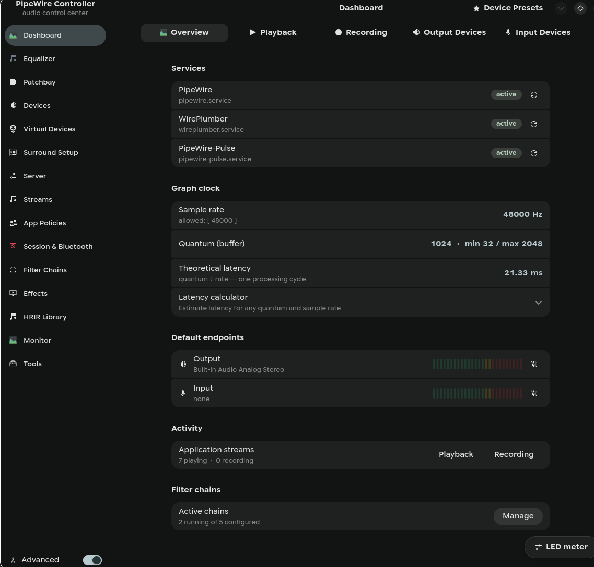

- **Equalizer page** — parametric-equalizer outputs you route audio through.
  Import an AutoEQ / APO `ParametricEq.txt` (browse or just drag the file onto
  the row), or dial the bands in by hand: each band has its own type, frequency,
  gain and Q, and its own switch so you can hear one filter in isolation without
  deleting it. One click makes an equalizer the default output.
- **Live A/B compare** (beta) — switch an equalizer in and out *while it keeps
  running*, so playback never pauses. Bypassed audio goes straight to the
  output device.

  
  

- **Microphone cleanup** — a clean copy of your microphone with echo and
  background noise removed (WebRTC). Noise suppression, automatic gain, a
  high-pass filter and voice-activity detection are individual switches, with
  extended-filter, delay-agnostic and transient suppression under Advanced. By
  default it uses whatever is playing on your speakers as the echo reference,
  so there is nothing to route.

  

- **Clearer running devices.** A running equalizer or microphone is marked with
  an accent edge that runs the whole height of its block, stopped ones step
  back, and the inline mixer is laid out as the signal path — level, compare,
  what is playing through it, where it goes.
- **Fixed:** text containing `&` or `<` made a row's title or subtitle vanish
  entirely. This hit stream names reported by apps, device descriptions and
  anything you had typed yourself — equalizer, filter-chain and virtual-device
  names, app policies and HRIR filenames.

---

## [v0.3.5](https://github.com/knightinfected/PipeWireController/releases/tag/v0.3.5) — 2026-07-29
**Bug fixes related to Card Config and additions- Card configuration is its own control — with a way out of a broken profile**

- **Configuration switcher is now a dedicated row**, one per card, on the
  Output/Input Devices tabs — instead of riding on one arbitrary device row.
  It no longer jumps between rows or disappears when a profile exposes several
  sinks at once (Pro Audio) or none at all (Off), so the switcher — and the way
  back — is always reachable.
- **Added One-click Reset to a working profile** when a card gets stuck. WirePlumber
  can save a profile that later can't work (e.g. an HDMI-surround profile saved
  while nothing is plugged into HDMI), leaving you with no audio and, before,
  no obvious way out.
- **Added "unavailable" warning** — the ⚠ now flags only profiles that are
  genuinely unavailable, so a playable-but-unprobeable profile like *Pro Audio*
  is no longer falsely marked.

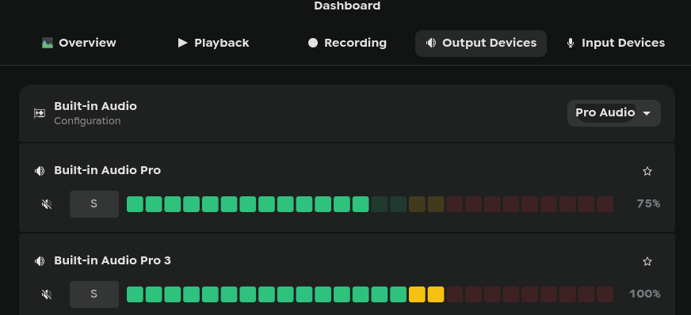
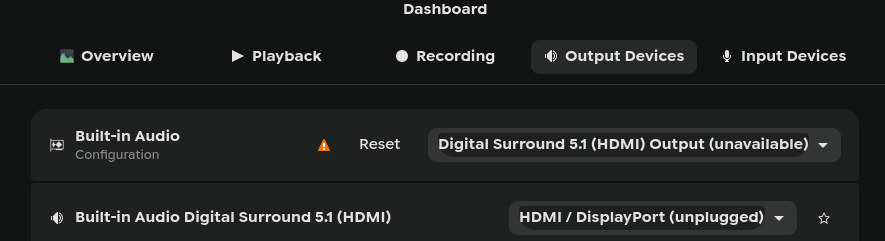

---

## [v0.3.4](https://github.com/knightinfected/PipeWireController/releases/tag/v0.3.4) — 2026-07-27
**Import your existing virtual devices**

- **Import existing devices** (Virtual Devices page) — adopt loopback,
  combine, and null-sink drop-ins you hand-wrote in
  `~/.config/pipewire/pipewire.conf.d`. They're classified into the right kind
  (null sink · virtual mic · bus · combined), imported disabled, and the
  original file is moved into an `inactive/` folder so it loads only once (no
  duplicate). A file picker covers configs kept elsewhere.
- The header-bar bookmark button is now labelled **Device Presets** so it reads
  clearly next to the star.

---

## [v0.3.3](https://github.com/knightinfected/PipeWireController/releases/tag/v0.3.3) — 2026-07-25
**Virtual-device fixes — Mono layout and no more stray mic routing**

- **Mono 1.0 layout** for virtual devices — null sinks, virtual mics,
  aggregates, and buses can now be created as mono. Editing an existing mono
  device selects the right layout too.
- **Fixed virtual mics auto-routing to the default sink** — the null-source
  playback stream now sets `node.autoconnect=false` (matching the null-sink and
  Pro Audio map nodes), so WirePlumber no longer links a virtual mic onto your
  speakers.

---

## [v0.3.2](https://github.com/knightinfected/PipeWireController/releases/tag/v0.3.2) — 2026-07-23
**Pro Audio channel maps and a dashboard configuration switcher**

- **Pro Audio channel map** (Virtual Devices) — map a friendly channel layout
  onto the generic AUX channels a card exposes in its *Pro Audio* profile
  (e.g. a stereo sink whose FL/FR land on the interface's AUX0/AUX1). Both
  output and input directions, arbitrary N-channel maps. The links survive
  reboots and PipeWire restarts.
- **Dashboard configuration switcher** — change a card's profile (Analog
  Stereo Duplex, Pro Audio, HDMI, Off, …) straight from the Output/Input
  Devices tabs, like pavucontrol's Configuration tab.
- **`pyproject.toml`** — a proper Python project (metadata, entry point, and
  dev tooling for type-checking/linting).
- Virtual-device dialog is now a **resizable window** with a larger default
  size; fixed note-wrapping and dropdown truncation in that dialog.

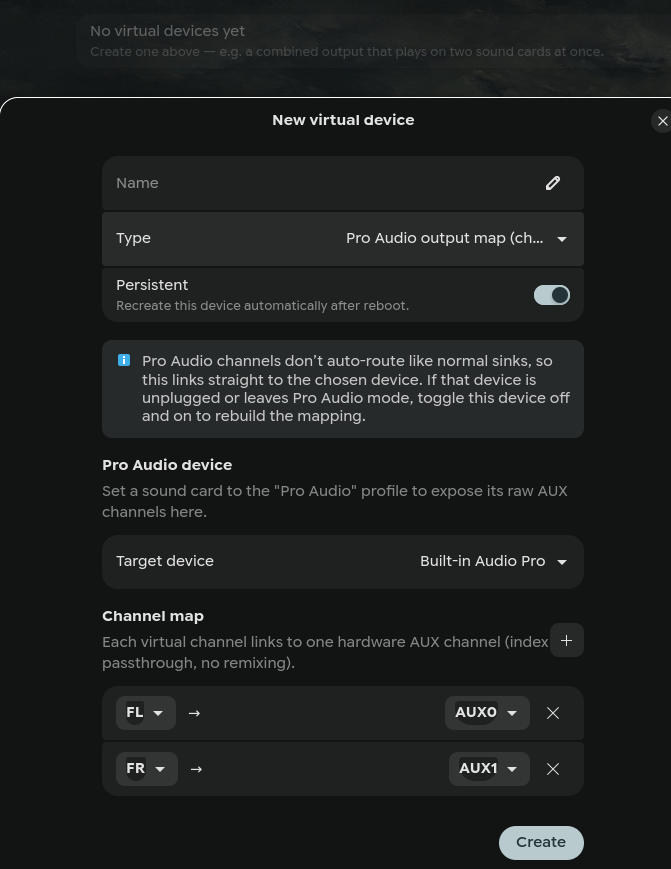
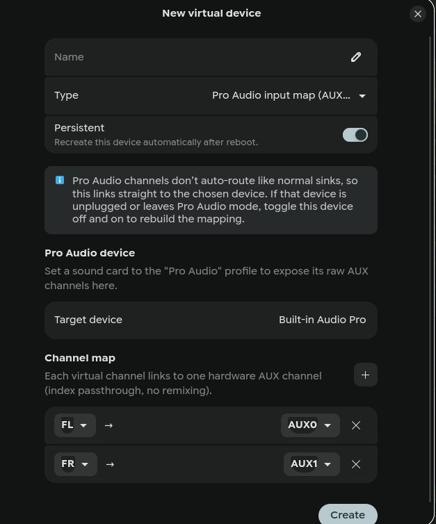
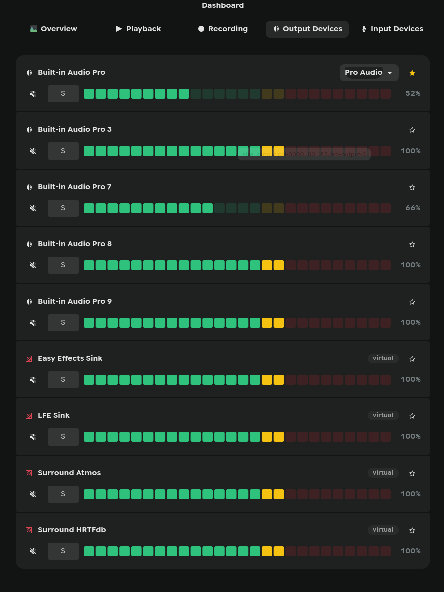
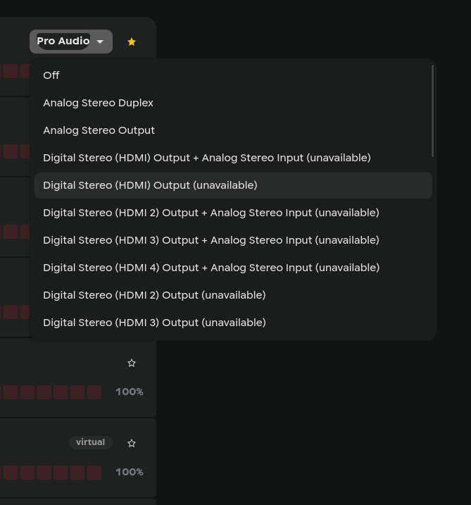
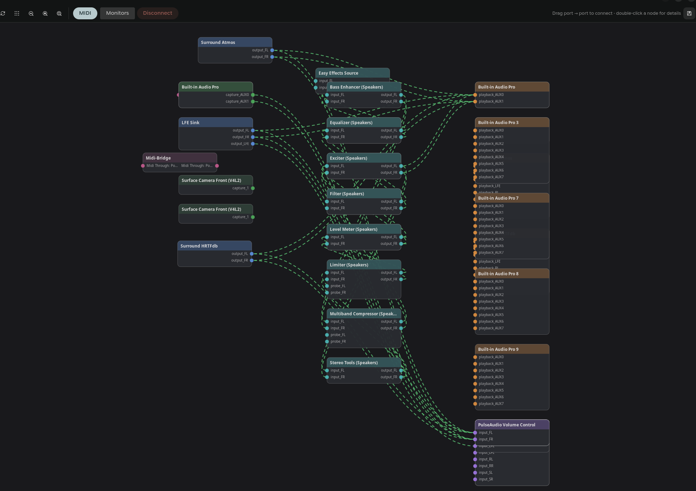

---

## [v0.3.1](https://github.com/knightinfected/PipeWireController/releases/tag/v0.3.1) — 2026-07-23
**Server tuning fixes — feedback from Wim Taymans (creator of PipeWire)**

- Raised the quantum hard-limit ceiling (8192 was only ~43 ms at 192 kHz;
  the dropdown now reaches 32768, real cap 65536) and explained the
  frames-vs-rate trade-off inline.
- Corrected the `link.max-buffers` description (it's mostly about video
  buffers, not audio) and its default.
- Added a **Custom…** typed entry to the Default/Minimum/Maximum quantum
  dropdowns for values off the preset list.

---

## [v0.3.0](https://github.com/knightinfected/PipeWireController/releases/tag/v0.3.0) — 2026-07-22
**The big one — Patchbay, Monitor, Virtual Devices, Effects, App Policies**

- **Patchbay** — live audio + MIDI node graph, drag-to-connect, node metadata
  editor, routing snapshots (save/recall/export/import).
- **Monitor** — service CPU/RAM, xruns, DSP load, live `pw-top`, journal
  follow, desktop notifications.
- **Virtual Devices** — null sinks, virtual mics, combine/aggregate devices,
  buses.
- **Effects** — LADSPA/LV2 discovery and an insert-rack chain.
- **App Policies & per-device rules** — per-app routing, default-device
  priority, clock master, per-device rate/format/period/headroom/rename/hide,
  plus per-device Bluetooth profile & codec and dashboard mixer solo.

