# PipeWire Controller

[](https://aur.archlinux.org/packages/pipewire-controller)
[](LICENSE)

A native GTK4/libadwaita control center for PipeWire — for any Linux distro
running PipeWire (packaged on the AUR, install instructions for Fedora,
Ubuntu/Debian and others below).
Everything under PipeWire's *Configuration* documentation — clock/quantum
tuning, stream processing, session policy, filter chains, HRIR virtual
surround — exposed as toggles and dropdowns, plus a live **patchbay**,
performance **monitoring**, **virtual devices**, routing snapshots,
per-application **policies** and LADSPA/LV2 **effect inserts**
([new in v0.3.0](#new-in-v030)).


<p align="center">
  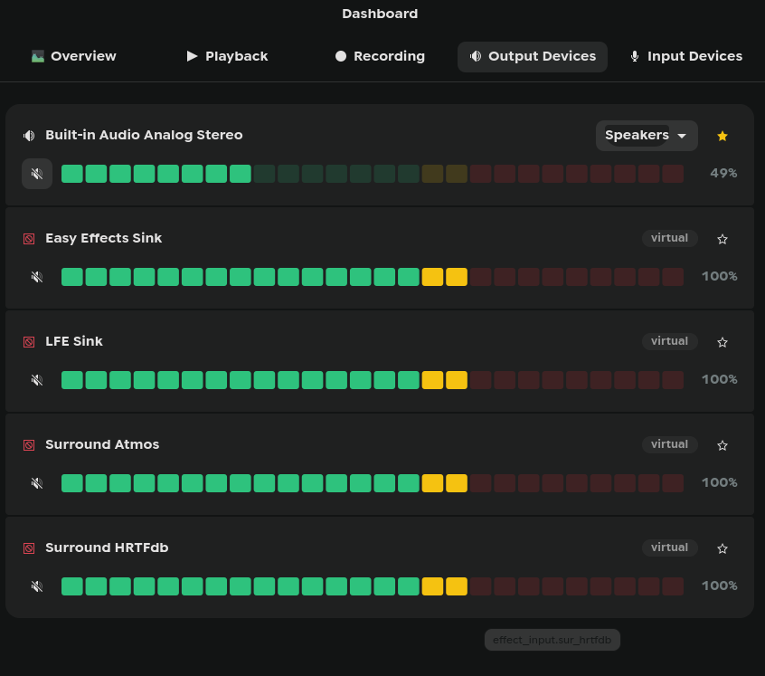
  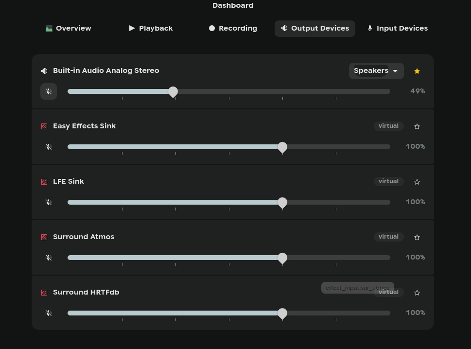
</p>
<p align="center">
  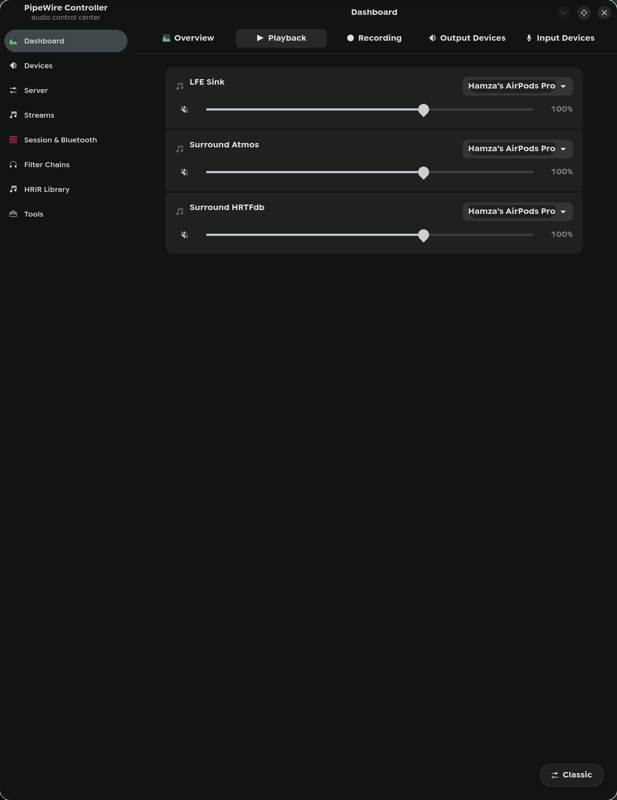
  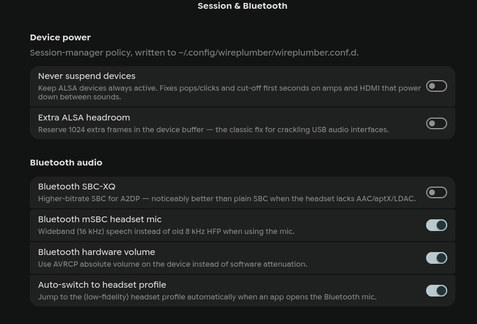
</p>
<p align="center">
  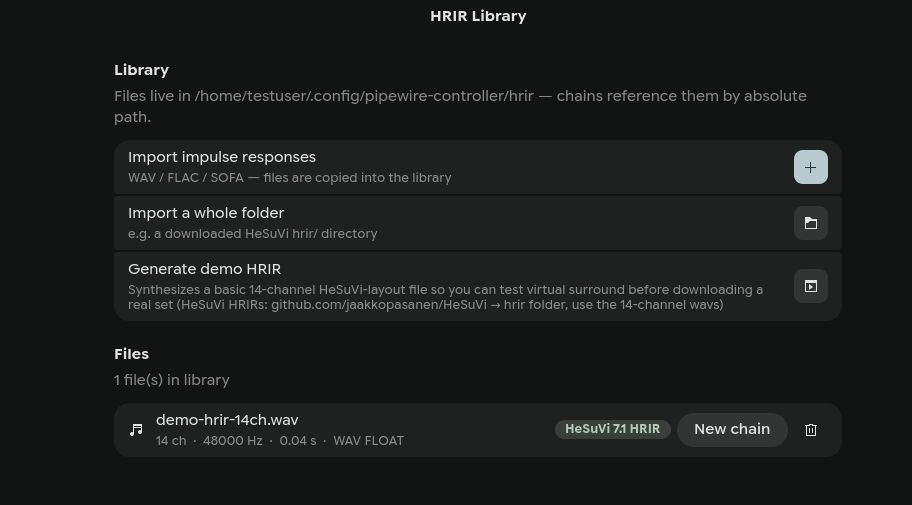
  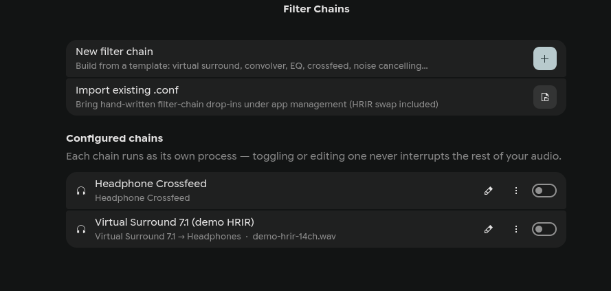
</p>
<p align="center">
  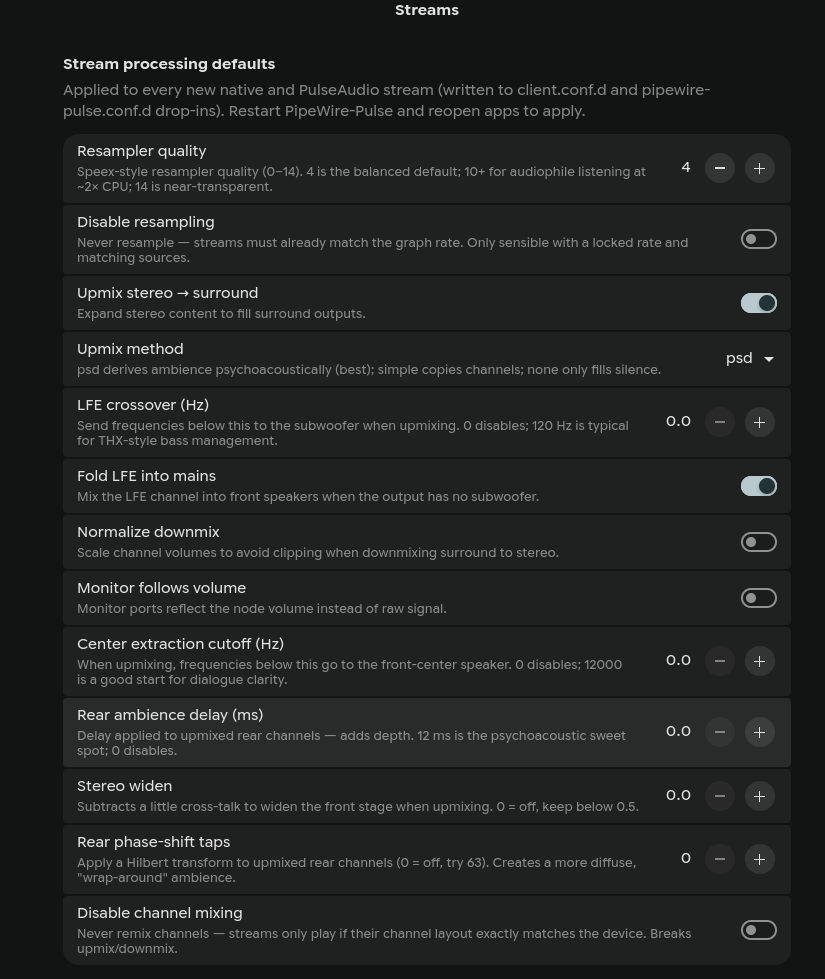
  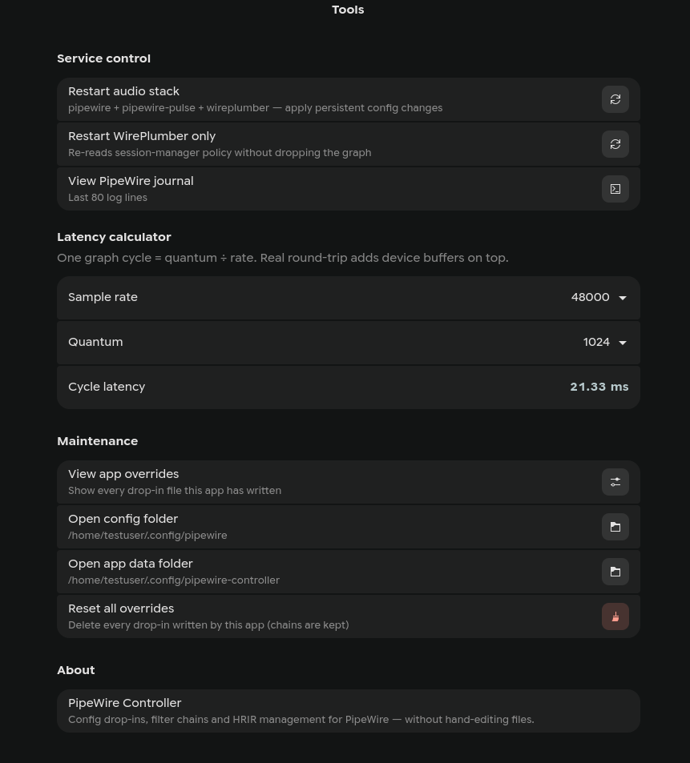
</p>
<p align="center">
  
</p>
<p align="center">
  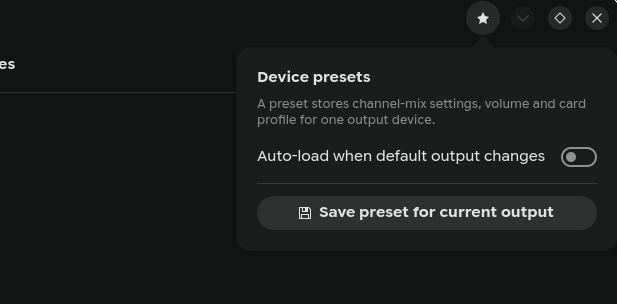
  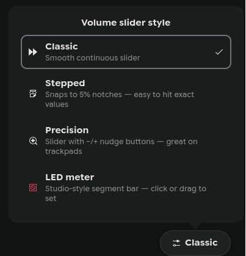
</p>

More screenshots:
[Playback tab, LED meters](screenshots/dashboard-led-meter.png) ·
[Output Devices with ports](screenshots/output-devices.png) ·
[Recording tab](screenshots/dashboard-recording.png) ·
[Surround Setup wizard](screenshots/surround-setup.png) ·
[Surround Setup, advanced mode](screenshots/surround-advanced.png) ·
[Filter Chains + HRIR close-up](screenshots/filter-chains-hrir.png)

## New in v0.3.0

v0.3 grows the app from a config editor into a full graph tool: a live
patchbay, performance monitoring, virtual devices, routing snapshots,
per-application policies and plugin effect inserts — all built on the same
"one process per thing, drop-ins only, never touch base files" foundation.

**Patchbay** — a live node graph of the whole session, audio *and* MIDI.
Drag a port onto another to connect, select a link and press Delete to
disconnect, drag nodes to arrange them (layout persists), pan/zoom, toggle
MIDI and monitor ports, and watch the signal flow animate along active
links. Double-click any node for its properties, per-node latency, and a
live **metadata editor** (e.g. pin a stream with `target.object`).

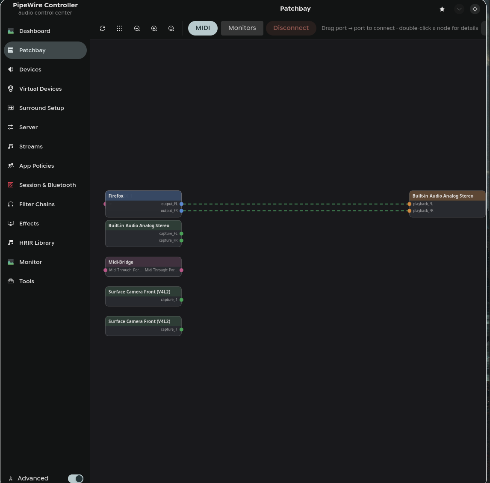

**Live Monitor** — per-service CPU and RAM sparklines, xrun and DSP-load
meters, a live `pw-top` table and a cursor-followed journal with a
warnings-only filter. Optional desktop notifications fire when a link
breaks, a service fails, or new dropouts appear.

<p align="center">
  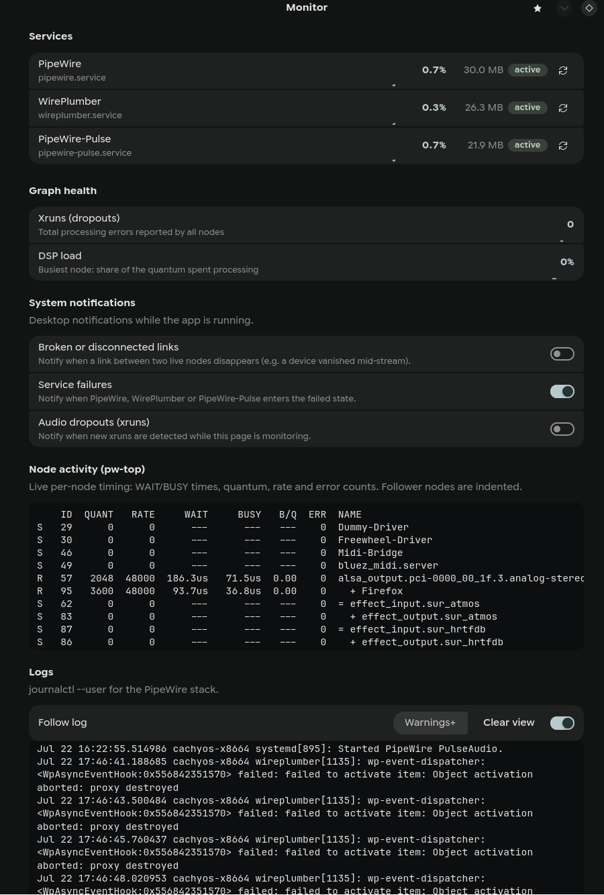
  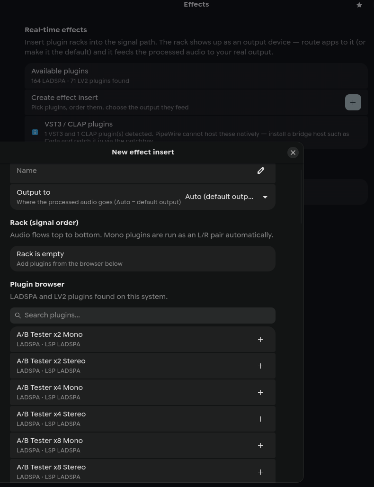
</p>

**Effects** — insert racks of **LADSPA/LV2 plugins** into the signal path;
the rack shows up as an output device you route apps through. Plugins are
discovered by introspection (164 LADSPA + 71 LV2 found on the dev machine),
reorderable in series, and mono plugins run as an L/R pair automatically.
VST3/CLAP presence is detected with a bridge-host hint.

**Virtual Devices** — create null sinks, virtual microphones,
combined/aggregate devices (one sink that plays on several cards at once)
and buses/sub-mixes. Each runs as its own tiny process — temporary or
persistent — so creating or removing one never interrupts playback.

<p align="center">
  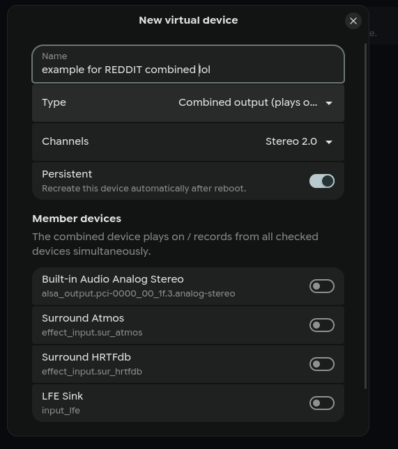
  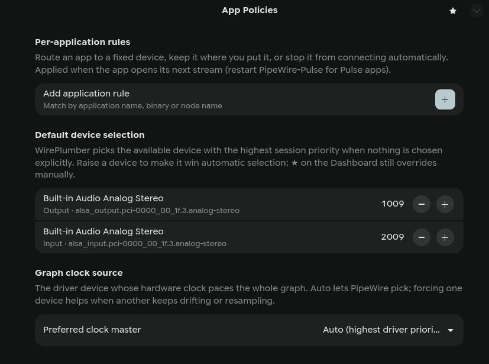
</p>

**App Policies** — per-application routing rules (send an app to a fixed
device, stop it auto-connecting, or pin it in place), default-device
priority, and a preferred graph **clock master**.

<p align="center">
  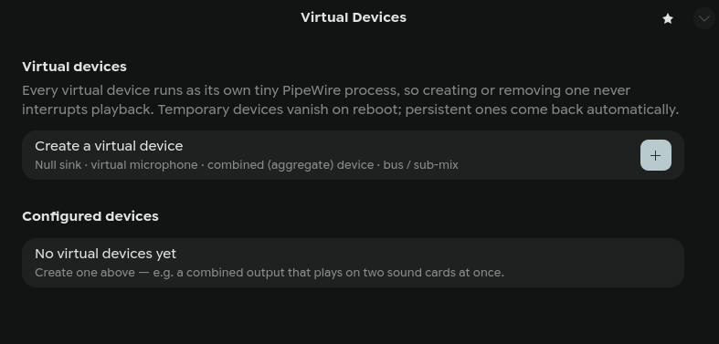
</p>

Also new: **routing snapshots** (save / recall / export / import the whole
patch by name), **per-device settings** on the Devices page (sample rate,
bit depth, period size, headroom, rename, hide), **per-device Bluetooth
profile & codec**, and **solo** toggles in the Dashboard mixer.

## If you like tinkering like me…

…here are some cool GitHubs to visit for sound tools:

- [JDSP4Linux](https://github.com/Audio4Linux/JDSP4Linux) — JamesDSP audio
  effects processor for PipeWire/PulseAudio
- [EasyEffects](https://github.com/wwmm/easyeffects) — the classic effects
  rack for PipeWire
- [coppwr](https://github.com/dimtpap/coppwr) — low-level PipeWire graph
  inspector and patchbay
- [polybar-pulseaudio-control](https://github.com/marioortizmanero/polybar-pulseaudio-control)
  — volume/sink switcher module for Polybar
- [virtual-surround-manager](https://github.com/Berny23/virtual-surround-manager)
  — HRIR-based virtual surround setup tool for Windows and Linux

…and some goated repos for presets, HRIRs, and DDCs:

- [M0Rf30/easyeffects-presets](https://github.com/M0Rf30/easyeffects-presets)
  — easily the best EasyEffects preset collection
- [HRIR database](https://airtable.com/appayGNkn3nSuXkaz/shruimhjdSakUPg2m/tbloLjoZKWJDnLtTc)
  — big searchable HRIR database (Airtable)
- [GentleDynamics](https://github.com/droidwayin/GentleDynamics) — the best presets 
  if you want add your own HRIRs
- [JackHack96/EasyEffects-Presets](https://github.com/JackHack96/EasyEffects-Presets)
  — the default recommendation for EasyEffects presets
- [JamesDSP DDC library](https://media.aicp-rom.com/JamesDSP/DDC/) —
  headphone DDC correction files
- [Linux_Audio](https://github.com/BayouGuru67/Linux_Audio) — hard stuff
  for large speaker systems

## Requirements

Linux with a running **PipeWire** audio session — PipeWire ≥ 1.0 and
WirePlumber ≥ 0.5 (port/profile switching uses `wpctl set-route` /
`set-profile`). GTK 4 with **libadwaita ≥ 1.4**, Python ≥ 3.10. Pure
Python, no build step. Developed and tested on PipeWire 1.6 /
libadwaita 1.9.

## Install

### Arch / CachyOS / EndeavourOS / Manjaro

Available on the [AUR](https://aur.archlinux.org/packages/pipewire-controller):

```bash
paru -S pipewire-controller   # or: yay -S pipewire-controller
```

This installs everything (app, dependencies, desktop entry) — skip the
Run section below. To run from a git checkout instead, install the
dependencies manually:

```bash
sudo pacman -S --needed pipewire wireplumber pipewire-pulse gtk4 libadwaita \
    python-gobject python-numpy python-soundfile
```

### Fedora

```bash
sudo dnf install pipewire wireplumber pipewire-pulseaudio gtk4 libadwaita \
    python3-gobject python3-numpy python3-soundfile
```

### Ubuntu 24.04+ / Debian 13+

```bash
sudo apt install pipewire wireplumber pipewire-pulse gir1.2-gtk-4.0 \
    gir1.2-adw-1 python3-gi python3-numpy python3-soundfile
```

Older releases ship a libadwaita before 1.4 and won't work.

### Other distros

Install GTK 4 + libadwaita (≥ 1.4) with GObject introspection and
PyGObject from your package manager, then grab the Python audio bits via
pip if your distro doesn't package them:

```bash
python3 -m pip install --user numpy soundfile
```

Optional extras on any distro: `noise-suppression-for-voice` (RNNoise mic
template), `lsp-plugins-ladspa` (extra LADSPA plugins for imported
chains), PipeWire built with libmysofa (SOFA spatializer templates).

## Run

```bash
git clone https://github.com/knightinfected/PipeWireController.git
cd PipeWireController
./pipewire-controller
```

Optional app-menu entry (the desktop file expects `pipewire-controller`
on your `PATH`, which the symlink provides):

```bash
mkdir -p ~/.local/bin ~/.local/share/applications
ln -sf "$PWD/pipewire-controller" ~/.local/bin/
cp pipewire-controller.desktop ~/.local/share/applications/
```

## What it does

**Dashboard** — pavucontrol-style tabs, refreshed live:
- *Playback / Recording*: every application stream with volume, mute and a
  device dropdown that **moves the stream live** (`target.object`
  metadata); recording streams can capture any source or any sink's
  monitor ("Monitor of X").
- *Output / Input Devices*: volume, mute, default star and **port
  selection** (speakers/headphones/HDMI, with unplugged markers).
- *Overview*: service states, graph rate/quantum/latency, an interactive
  **latency calculator** (with one-click "test live" via force-quantum/rate),
  default endpoints, stream activity, filter-chain summary.
- Four **volume-slider styles** — classic, stepped (5% notches), precision
  (−/+ nudge buttons for trackpads), LED meter (studio segment bar) —
  switchable from the pill in the bottom-right corner.

**Patchbay** — a live, draggable node graph of every node, port and link in
the session (audio and MIDI). Connect by dragging a port onto another,
disconnect a selected link with Delete, and double-click a node to edit its
metadata and read its declared latency. Save the whole routing as a named
**snapshot** and recall, export or import it later.

**Devices** — every sink and source (including virtual filter-chain sinks):
set default, volume, mute. Hardware devices expand to **per-device
settings** — sample rate, bit depth, ALSA period size, headroom, preferred
quantum, suspend timeout, plus rename/hide — written as WirePlumber rules.

**Virtual Devices** — null sinks, virtual microphones, combined/aggregate
outputs (play on several cards at once) and buses/sub-mixes, each as its own
lightweight process; temporary or persistent across reboots.

**App Policies** — per-application rules (fixed target device, disable
auto-connect, pin in place), per-device default-selection priority, and a
preferred graph clock master.

**Effects** — a LADSPA/LV2 plugin browser and a rack builder; racks become
routable output devices. VST3/CLAP are detected with a bridge-host hint.

**Monitor** — service CPU/RAM, xrun and DSP-load meters, a live `pw-top`
table, a follow-along journal, and optional desktop notifications for broken
links, service failures and dropouts.

**Surround Setup** — a guided wizard for real 5.1/7.1 rigs: choose the
layout, pick the matching sound-card profile (★ suggests the right one;
applied instantly — doubles as a Bluetooth codec picker), apply
recommended upmix/bass-management defaults per layout, then click each
speaker on a room map to hear a test tone (the subwoofer gets 60 Hz). For
headphone users there's a one-click **Virtual 7.1 Headphones** sink —
clearly marked as virtual, never made the default automatically, and
removable like any other chain.

**Advanced toggle** (bottom-left) reveals a curated set of deeper settings
across all pages — quantum hard limit, RT scheduling, strict checks,
center-extraction cutoff, rear ambience delay, stereo widen, Hilbert taps,
ALSA headroom, and more — each explained in plain language.

**Device presets** (bookmark menu, top-right) — snapshot channel-mix
settings, volume and card profile per output device, re-apply them with one
click, or let the app auto-apply a device's preset whenever it becomes the
default output (e.g. Bluetooth headphones reconnecting).

**Server** — two layers, clearly separated:
- *Runtime overrides* (instant, non-persistent): force sample rate, force
  quantum via `pw-metadata -n settings` — experiment freely, a restart
  resets them.
- *Persistent settings*: default/allowed sample rates, quantum min/default/
  max, power-of-two quantum, mlock, denormals, RT priority, link buffers,
  strict checks, log level. The app shows the **actual merged value** from
  `/usr/share` → `/etc` → `~/.config` (including distro tweaks), marks
  anything it has overridden with an accent bar, and offers one-click reset
  per row.

**Streams** — resampler quality (0–14), disable resampling,
stereo→surround upmix (psd/simple/none), LFE crossover, LFE folding,
normalize downmix, monitor volumes. Written to *both* `client.conf.d` and
`pipewire-pulse.conf.d` so native and Pulse apps behave identically.

**Session & Bluetooth** (WirePlumber) — never-suspend devices (fixes pops /
cut-off first seconds), SBC-XQ, mSBC wideband mic, hardware volume,
auto-switch to headset profile, and **per-device Bluetooth profile & codec**
selection for each connected device.

**Filter Chains** — the core:
- Create / edit / clone / delete / enable / disable from the GUI; valid SPA
  JSON is always generated and validated before it is written.
- **Each chain runs as its own process** (`pwctl-chain@<id>` systemd user
  unit running `pipewire -c`). Toggling, editing or swapping the HRIR of one
  chain restarts *only that chain's process* — your main audio never skips.
- Templates: Virtual Surround 7.1 / 5.1 / stereo-widener (14-ch HeSuVi
  HRIR), plain 7.1 passthrough sink (no HRIR), true-stereo 4-ch IR
  convolver, 1–2-ch stereo convolver, SOFA spatializer 7.1/5.1, headphone
  crossfeed (no IR needed), parametric EQ with AutoEq file support, bass
  boost, RNNoise noise-cancelling mic.
- The right template is auto-selected from the analyzed channel count of the
  chosen IR (14 ch → HeSuVi, 4 ch → true-stereo, 1–2 ch → stereo IR,
  `.sofa` → spatializer).
- Optional fixed output device per chain, convolver gain, per-template knobs.
- **Import** detects your existing hand-written drop-ins in
  `~/.config/pipewire/filter-chain.conf.d/` (including an `inactive/`
  folder), brings them under app management verbatim, and still supports
  HRIR swapping and raw text editing with validation.
- Per-chain journal viewer and generated-config viewer.

**HRIR Library** — import single files or whole folders (e.g. a downloaded
HeSuVi `hrir/` directory). Every file is analyzed (channels / rate / length /
format) and classified: 14 ch = HeSuVi, 4 ch = true stereo, 1–2 ch = plain
IR, `.sofa` = HRTF. "New chain" on any file creates a chain with the right
template pre-selected. A built-in generator synthesizes a basic 14-channel
demo HRIR so virtual surround can be tested before downloading a real set
(get real ones from the HeSuVi project's `hrir` folder — use the 14-channel
wavs, not the `*-.wav` variants).

**Tools** — restart audio stack / WirePlumber, journal viewer, latency
calculator, view every drop-in the app has written, open config folders,
one-click *reset all overrides*.

## Where things are written

| What | Where |
|---|---|
| Server settings | `~/.config/pipewire/pipewire.conf.d/99-pipewire-controller.conf` |
| Stream settings | `~/.config/pipewire/{client,pipewire-pulse}.conf.d/99-pipewire-controller.conf` |
| Session settings | `~/.config/wireplumber/wireplumber.conf.d/99-pipewire-controller.conf` |
| Device & app policy rules | `~/.config/pipewire-controller/rules.json` (regenerates the WirePlumber and stream drop-ins above) |
| Chain metadata | `~/.config/pipewire-controller/chains/*.json` |
| Virtual device metadata | `~/.config/pipewire-controller/virtual/*.json` |
| Routing snapshots | `~/.config/pipewire-controller/routing/*.json` |
| Generated chain / virtual-device configs | `~/.config/pipewire-controller/generated/*.conf` |
| HRIR library | `~/.config/pipewire-controller/hrir/` |
| UI preferences & device presets | `~/.config/pipewire-controller/ui.json` |
| Chain / virtual-device runner unit | `~/.config/systemd/user/pwctl-chain@.service` |

Deleting those paths removes every trace of the app. Base config files are
never modified.

## Design notes

- A small parser/serializer for PipeWire's relaxed **SPA JSON** dialect
  (`pwctl/spa_json.py`) reads any real-world config (verified round-trip on
  all shipped configs) and writes idiomatic conf files.
- Persistent changes surface a banner naming exactly which service needs a
  restart, with a one-click restart button; runtime changes apply instantly.
- All subprocess work (`pw-dump`, `systemctl`, …) runs off the UI thread.

## Acknowledgments

- Thanks to **Wim Taymans**, creator of PipeWire, for reviewing the Server
  page's quantum and buffer settings — his feedback corrected the
  `link.max-buffers` description and the quantum hard-limit range in v0.3.1.
