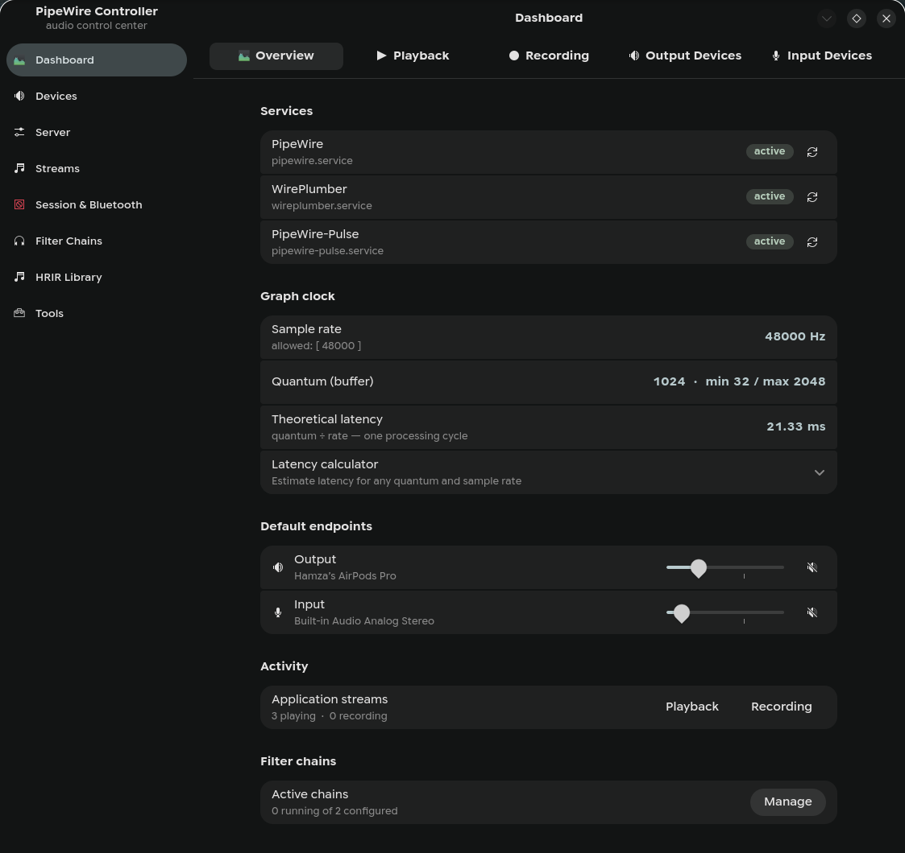
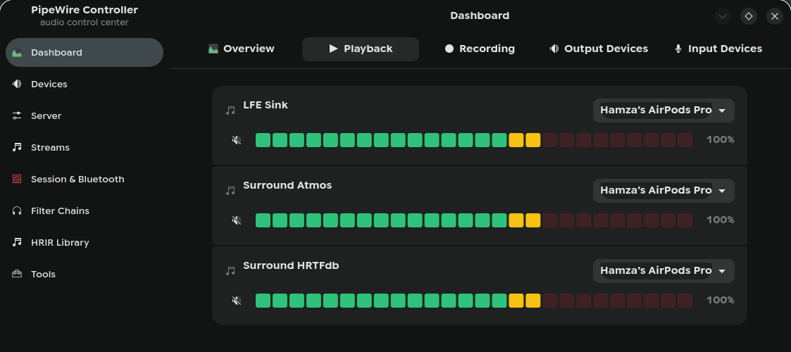
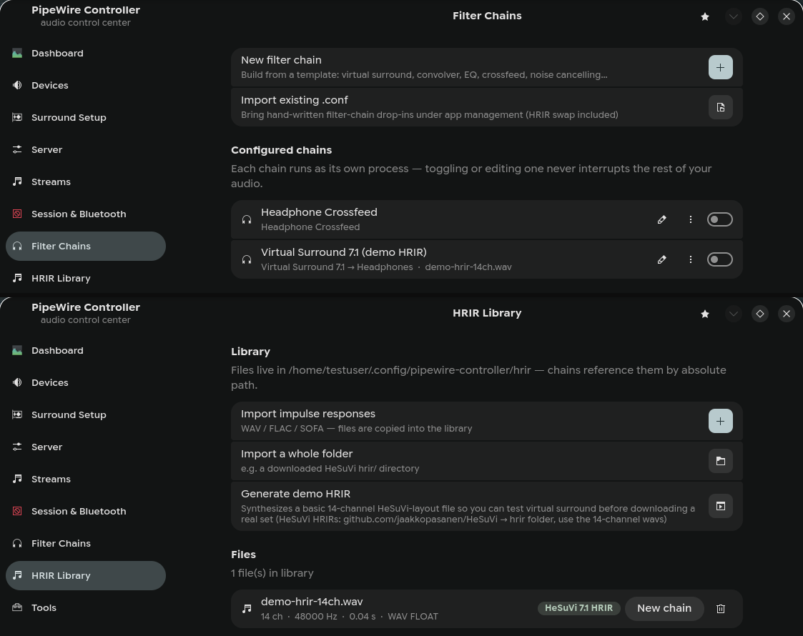
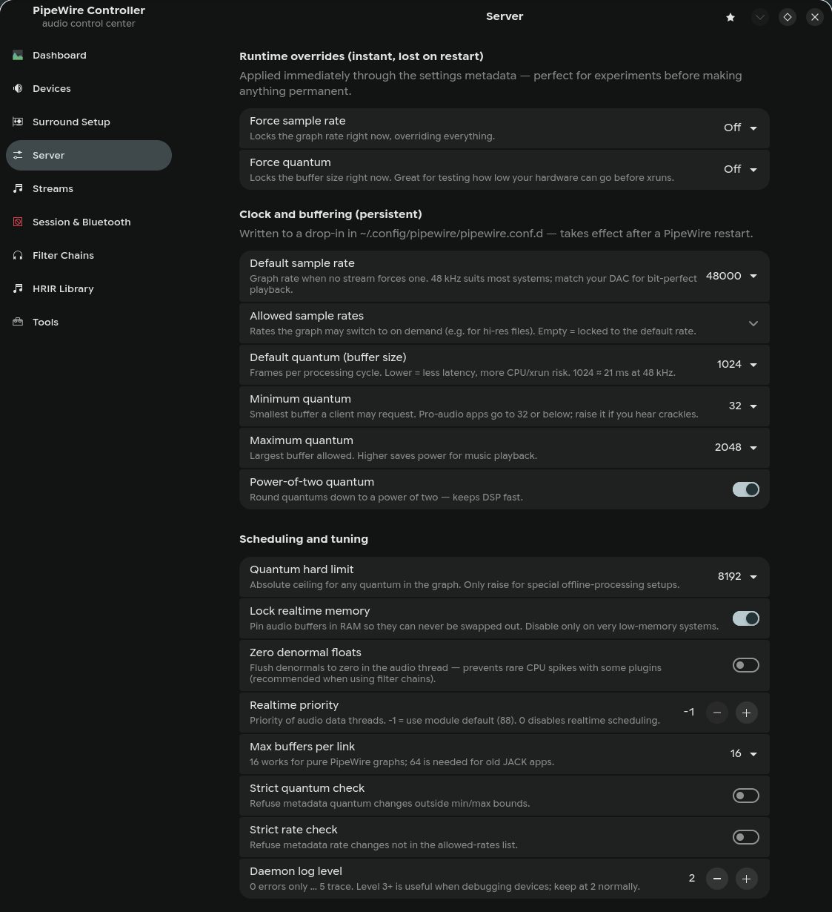

# PipeWire Controller

A native GTK4/libadwaita control center for PipeWire on Arch-based systems.
Everything under PipeWire's *Configuration* documentation — clock/quantum
tuning, stream processing, session policy, filter chains, HRIR virtual
surround — exposed as toggles and dropdowns. No hand-editing of config files,
ever.



<p align="center">
  
  
</p>
<p align="center">
  
</p>

More screenshots:
[Playback tab](screenshots/dashboard-playback.png) ·
[Output Devices with ports](screenshots/output-devices.png) ·
[Recording tab](screenshots/dashboard-recording.png) ·
[Surround Setup wizard](screenshots/surround-setup.png) ·
[Surround Setup, advanced mode](screenshots/surround-advanced.png)

## Run

```bash
./pipewire-controller
```

Dependencies (all in the Arch repos): `pipewire` `wireplumber` `gtk4`
`libadwaita` `python-gobject` `python-soundfile` `python-numpy`.
Optional: `noise-suppression-for-voice` (RNNoise mic template),
`lsp-plugins-ladspa` (extra LADSPA plugins for imported chains).

Install the launcher entry:

```bash
cp pipewire-controller.desktop ~/.local/share/applications/
```

## What it does

**Dashboard** — pavucontrol-style tabs, refreshed live:
- *Playback / Recording*: every application stream with volume, mute and a
  device dropdown that **moves the stream live** (`target.object`
  metadata); recording streams can capture any source or any sink's
  monitor ("Monitor of X").
- *Output / Input Devices*: volume, mute, default star and **port
  selection** (speakers/headphones/HDMI, with unplugged markers).
- *Overview*: service states, graph rate/quantum/latency, an interactive
  **latency calculator** (with one-click "test live" via force-quantum/rate),
  default endpoints, stream activity, filter-chain summary.
- Four **volume-slider styles** — classic, stepped (5% notches), precision
  (−/+ nudge buttons for trackpads), LED meter (studio segment bar) —
  switchable from the pill in the bottom-right corner.

**Devices** — every sink and source (including virtual filter-chain sinks):
set default, volume, mute.

**Surround Setup** — a guided wizard for real 5.1/7.1 rigs: choose the
layout, pick the matching sound-card profile (★ suggests the right one;
applied instantly — doubles as a Bluetooth codec picker), apply
recommended upmix/bass-management defaults per layout, then click each
speaker on a room map to hear a test tone (the subwoofer gets 60 Hz). For
headphone users there's a one-click **Virtual 7.1 Headphones** sink —
clearly marked as virtual, never made the default automatically, and
removable like any other chain.

**Advanced toggle** (bottom-left) reveals a curated set of deeper settings
across all pages — quantum hard limit, RT scheduling, strict checks,
center-extraction cutoff, rear ambience delay, stereo widen, Hilbert taps,
ALSA headroom, and more — each explained in plain language.

**Device presets** (bookmark menu, top-right) — snapshot channel-mix
settings, volume and card profile per output device, re-apply them with one
click, or let the app auto-apply a device's preset whenever it becomes the
default output (e.g. Bluetooth headphones reconnecting).

**Server** — two layers, clearly separated:
- *Runtime overrides* (instant, non-persistent): force sample rate, force
  quantum via `pw-metadata -n settings` — experiment freely, a restart
  resets them.
- *Persistent settings*: default/allowed sample rates, quantum min/default/
  max, power-of-two quantum, mlock, denormals, RT priority, link buffers,
  strict checks, log level. The app shows the **actual merged value** from
  `/usr/share` → `/etc` → `~/.config` (including distro tweaks), marks
  anything it has overridden with an accent bar, and offers one-click reset
  per row.

**Streams** — resampler quality (0–14), disable resampling,
stereo→surround upmix (psd/simple/none), LFE crossover, LFE folding,
normalize downmix, monitor volumes. Written to *both* `client.conf.d` and
`pipewire-pulse.conf.d` so native and Pulse apps behave identically.

**Session & Bluetooth** (WirePlumber) — never-suspend devices (fixes pops /
cut-off first seconds), SBC-XQ, mSBC wideband mic, hardware volume,
auto-switch to headset profile.

**Filter Chains** — the core:
- Create / edit / clone / delete / enable / disable from the GUI; valid SPA
  JSON is always generated and validated before it is written.
- **Each chain runs as its own process** (`pwctl-chain@<id>` systemd user
  unit running `pipewire -c`). Toggling, editing or swapping the HRIR of one
  chain restarts *only that chain's process* — your main audio never skips.
- Templates: Virtual Surround 7.1 / 5.1 / stereo-widener (14-ch HeSuVi
  HRIR), plain 7.1 passthrough sink (no HRIR), true-stereo 4-ch IR
  convolver, 1–2-ch stereo convolver, SOFA spatializer 7.1/5.1, headphone
  crossfeed (no IR needed), parametric EQ with AutoEq file support, bass
  boost, RNNoise noise-cancelling mic.
- The right template is auto-selected from the analyzed channel count of the
  chosen IR (14 ch → HeSuVi, 4 ch → true-stereo, 1–2 ch → stereo IR,
  `.sofa` → spatializer).
- Optional fixed output device per chain, convolver gain, per-template knobs.
- **Import** detects your existing hand-written drop-ins in
  `~/.config/pipewire/filter-chain.conf.d/` (including an `inactive/`
  folder), brings them under app management verbatim, and still supports
  HRIR swapping and raw text editing with validation.
- Per-chain journal viewer and generated-config viewer.

**HRIR Library** — import single files or whole folders (e.g. a downloaded
HeSuVi `hrir/` directory). Every file is analyzed (channels / rate / length /
format) and classified: 14 ch = HeSuVi, 4 ch = true stereo, 1–2 ch = plain
IR, `.sofa` = HRTF. "New chain" on any file creates a chain with the right
template pre-selected. A built-in generator synthesizes a basic 14-channel
demo HRIR so virtual surround can be tested before downloading a real set
(get real ones from the HeSuVi project's `hrir` folder — use the 14-channel
wavs, not the `*-.wav` variants).

**Tools** — restart audio stack / WirePlumber, journal viewer, latency
calculator, view every drop-in the app has written, open config folders,
one-click *reset all overrides*.

## Where things are written

| What | Where |
|---|---|
| Server settings | `~/.config/pipewire/pipewire.conf.d/99-pipewire-controller.conf` |
| Stream settings | `~/.config/pipewire/{client,pipewire-pulse}.conf.d/99-pipewire-controller.conf` |
| Session settings | `~/.config/wireplumber/wireplumber.conf.d/99-pipewire-controller.conf` |
| Chain metadata | `~/.config/pipewire-controller/chains/*.json` |
| Generated chain configs | `~/.config/pipewire-controller/generated/*.conf` |
| HRIR library | `~/.config/pipewire-controller/hrir/` |
| UI preferences & device presets | `~/.config/pipewire-controller/ui.json` |
| Chain runner unit | `~/.config/systemd/user/pwctl-chain@.service` |

Deleting those paths removes every trace of the app. Base config files are
never modified.

## Design notes

- A small parser/serializer for PipeWire's relaxed **SPA JSON** dialect
  (`pwctl/spa_json.py`) reads any real-world config (verified round-trip on
  all shipped configs) and writes idiomatic conf files.
- Persistent changes surface a banner naming exactly which service needs a
  restart, with a one-click restart button; runtime changes apply instantly.
- All subprocess work (`pw-dump`, `systemctl`, …) runs off the UI thread.
